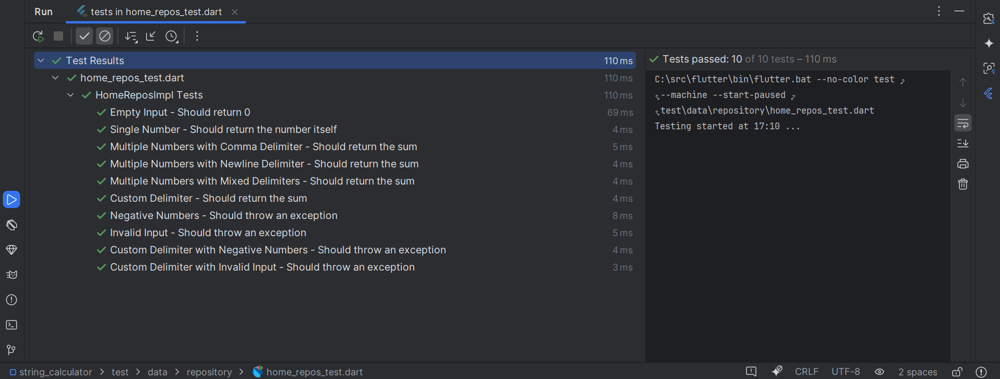

# string_calculator

A new Flutter project.

## Getting Started

This project is a starting point for a Flutter application.

This is a simple **Flutter project** that calculates the sum of numbers provided in a string. The function supports custom delimiters, handles newlines between numbers, and validates input to ensure it does not end with a delimiter or contain negative numbers.

### Function Signature

```dart
import 'package:string_calculator/domain/core/interfaces/home_repository.dart';

class HomeReposImpl implements HomeRepository {
  @override
  int add(String numbers) {

    // If numbers is empty returning 0.
    if (numbers.isEmpty) return 0;

    // Checking number delimiter.
    RegExp delimiter = RegExp(r',|\n');
    if (numbers.startsWith('//')) {
      final match = RegExp(r'^//(.+)\n(.*)').firstMatch(numbers);
      if (match != null) {
        delimiter = RegExp(match.group(1)!);
        numbers = match.group(2)!;
      }
    }
    final numArray = numbers.split(delimiter).map(int.parse).toList();

    //check and throw exception if negative numbers found.
    final negatives = numArray.where((number) => number < 0).toList();
    if (negatives.isNotEmpty) {
      throw "negative numbers not allowed ${negatives.join(', ')}";
    }

    //return sum of integer numbers
    return numArray.reduce((sum, number) => sum + number);
  }
}
```


*Example of the String Calculator in action.*




